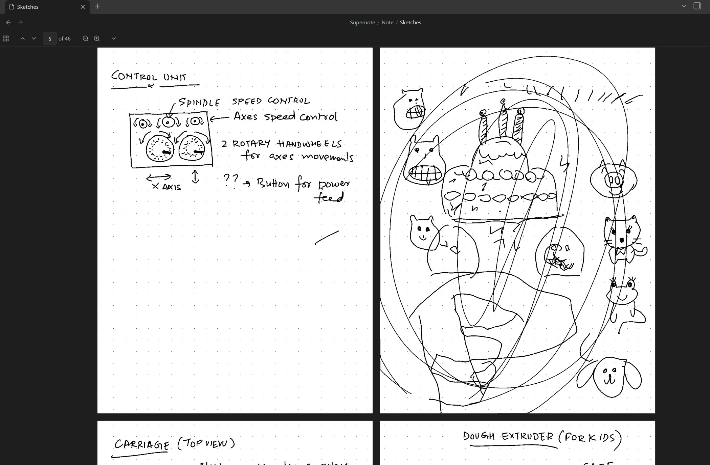
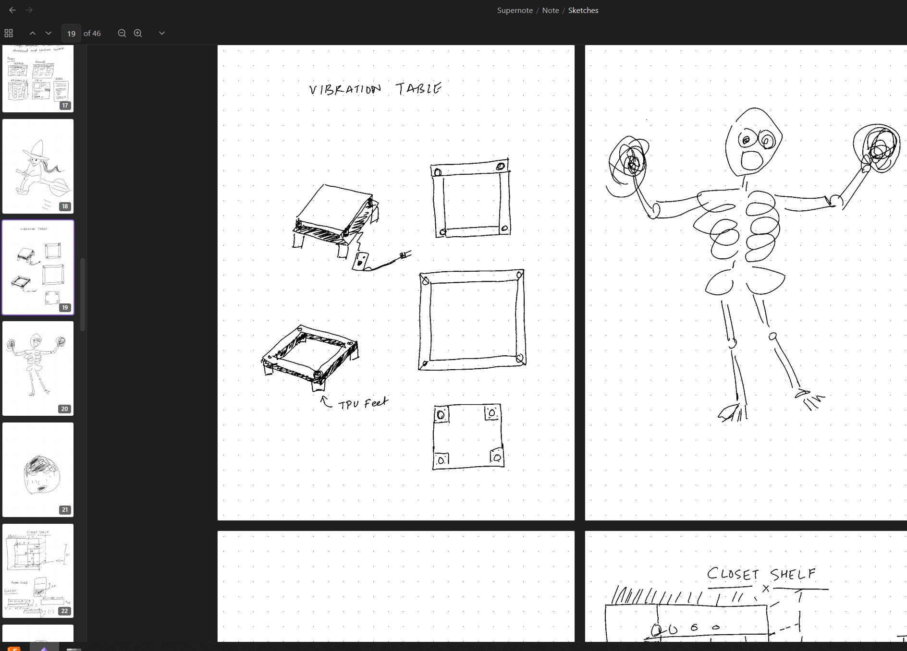
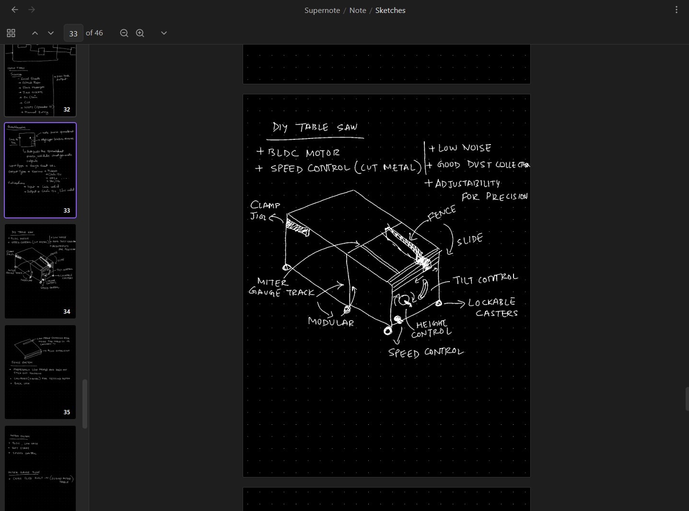

# Supernote for Obsidian

View your Supernote handwritten notes directly in Obsidian. No conversion needed, no external apps required.


## Screenshots

### Two-Page View (Light Mode)


### Thumbnail Sidebar Navigation


### Dark Mode with Adapt to Theme


### Full View with Sidebar (Dark Mode)


## Why Supernote?

If you own a Supernote device and use Obsidian for knowledge management, you've probably faced the challenge of integrating your handwritten notes with your digital vault. Until now, you had to:

- Export notes as PDFs (losing editability)
- Take screenshots (poor quality, manual process)
- Use separate apps to view your notes

**Supernote solves this.** It renders `.note` files natively inside Obsidian, making your handwritten notes first-class citizens in your vault.

## Features

### Native .note File Rendering
Open any Supernote `.note` file directly in Obsidian. The plugin decodes the proprietary format and renders your handwritten content with full fidelity.

### Thumbnail Sidebar
Navigate multi-page documents easily with a resizable thumbnail panel. Click any thumbnail to jump directly to that page.

### Flexible View Options
- **Single Page Mode**: Focus on one page at a time
- **Two-Page Mode**: View spreads side by side (great for notebooks)
- **Fit to Width**: Pages fill the available width
- **Fit to Height**: See entire pages without scrolling

### Zoom Controls
Zoom in to see fine details or zoom out for an overview. Your zoom level is remembered per session.

### Page Navigation
- Click thumbnails to jump to any page
- Use the up/down arrow buttons
- Type a page number directly to jump there
- Your position in each file is automatically saved

### Dark Mode Support
The plugin adapts to your Obsidian theme. In dark mode, notes are automatically inverted for comfortable viewing. You can toggle this behavior with the **"Adapt to theme"** option if you prefer to see original colors.

### Auto-Refresh
When you sync updated notes from your Supernote (via Supernote Cloud, Dropbox, or direct USB), the viewer automatically refreshes to show the latest version.

### Performance Optimized
- Smart caching means previously viewed notes load instantly
- Progressive rendering for large documents
- Minimal memory footprint

## Installation

### From Community Plugins (Recommended)

1. Open Obsidian Settings
2. Go to **Community Plugins** and disable **Restricted Mode**
3. Click **Browse** and search for "Supernote"
4. Click **Install**, then **Enable**

### Manual Installation

1. Download the latest release from the [Releases page](https://github.com/HelloKashif/obsidian-supernote/releases):
   - `main.js`
   - `manifest.json`
   - `styles.css`
2. Create a folder called `obsidian-supernote` in your vault's `.obsidian/plugins/` directory
3. Copy the downloaded files into this folder
4. Restart Obsidian
5. Enable the plugin in Settings → Community Plugins

### From Source

```bash
git clone https://github.com/HelloKashif/obsidian-supernote.git
cd obsidian-supernote
npm install
npm run build
```

Copy `main.js`, `manifest.json`, and `styles.css` to your vault's `.obsidian/plugins/obsidian-supernote/` folder.

## Usage

### Basic Workflow

1. **Sync your Supernote files** to your Obsidian vault
   - Use Supernote Cloud sync to a folder in your vault
   - Or copy files via USB/Dropbox to your vault folder
2. **Click any `.note` file** in the Obsidian file explorer
3. **View and navigate** your handwritten notes

### Controls Reference

| Control | Action |
|---------|--------|
| Thumbnail button (grid icon) | Show/hide thumbnail sidebar |
| Up/Down arrows | Navigate to previous/next page |
| Page number field | Click and type to jump to a specific page |
| Zoom +/- buttons | Increase or decrease zoom level |
| Dropdown arrow | Open view options menu |

### View Options Menu

Click the dropdown arrow in the toolbar to access:

- **Fit width** / **Fit height**: Choose how pages are scaled
- **Single page** / **Two-page**: Choose layout mode
- **Adapt to theme**: Toggle automatic color inversion in dark mode

### Resizing the Thumbnail Sidebar

Drag the right edge of the thumbnail sidebar to resize it. The sidebar can be anywhere from 100px to 400px wide.

## Syncing Your Supernote Files

### Option 1: Supernote Cloud

1. Enable Supernote Cloud on your device
2. Set up sync to a folder within your Obsidian vault
3. Files will automatically sync and update in Obsidian

### Option 2: Dropbox/Third-Party Cloud

1. Configure your Supernote to sync with Dropbox
2. Set up Dropbox on your computer to sync to your vault folder
3. Notes will flow from Supernote → Dropbox → Obsidian

### Option 3: Direct USB Transfer

1. Connect your Supernote via USB
2. Copy `.note` files directly to your Obsidian vault
3. Files are immediately available in Obsidian

## Compatibility

### Tested Devices
- Supernote A5X
- Supernote A5X2
- Supernote A6X
- Supernote A6X2
- Supernote Nomad

### Obsidian Requirements
- Obsidian v1.0.0 or higher
- Works on desktop (Windows, macOS, Linux)
- Works on mobile (iOS, Android)

### File Format Support
- `.note` files from any Supernote device
- All layer types (main layer, additional layers)
- All pen types and colors

## Troubleshooting

### Notes appear blank or corrupted
- Ensure the file finished syncing completely
- Try closing and reopening the file
- Check if the file opens correctly on your Supernote

### Dark mode colors look wrong
- Open the view options menu (dropdown arrow)
- Toggle "Adapt to theme" to switch between inverted and original colors

### Plugin doesn't load
- Ensure you have all three files: `main.js`, `manifest.json`, `styles.css`
- Check that they're in `.obsidian/plugins/obsidian-supernote/`
- Try disabling and re-enabling the plugin
- Restart Obsidian

### Performance is slow with large files
- The first load may take a moment for very large documents
- Subsequent views use cached images and load instantly
- Try reducing the zoom level for smoother scrolling

## Roadmap

Potential future features (contributions welcome!):

- [ ] Text layer extraction (for searchable content)
- [ ] Export to PNG/PDF from within Obsidian
- [ ] Annotation support (view highlights and comments)
- [ ] Link recognition (tap links in notes)
- [ ] Integration with Obsidian's backlinks

## Contributing

Contributions are welcome! Here's how you can help:

1. **Report bugs**: Open an issue describing the problem
2. **Suggest features**: Open an issue with your idea
3. **Submit code**: Fork the repo and open a pull request

### Development Setup

```bash
git clone https://github.com/HelloKashif/obsidian-supernote.git
cd obsidian-supernote
npm install
npm run dev  # Watch mode for development
```

### Project Structure

```
obsidian-supernote/
├── src/
│   ├── main.ts      # Plugin entry point and view implementation
│   ├── parser.ts    # .note file format parser
│   └── renderer.ts  # RLE bitmap decoder and image generation
├── styles.css       # Plugin styles
├── manifest.json    # Obsidian plugin manifest
└── esbuild.config.mjs
```

## FAQ

**Q: Will editing notes in Obsidian sync back to my Supernote?**
A: No, this is a viewer only. The Supernote format is complex and editing would require significant reverse-engineering. Your notes remain read-only in Obsidian.

**Q: Can I convert .note files to other formats?**
A: Not directly through this plugin. For conversion, consider using [supernote-tool](https://github.com/jya-dev/supernote-tool).

**Q: Does this work with Supernote Manta?**
A: We haven't tested with Manta yet. If you have one, please let us know if it works!

**Q: Will my handwritten text be searchable in Obsidian?**
A: Not currently. The plugin renders pages as images. Text extraction is on the roadmap for future versions.

**Q: How much space do cached images use?**
A: The plugin keeps only the 10 most recently viewed files in memory. Cache is cleared when you close Obsidian.

## License

MIT License - see [LICENSE](LICENSE) for details.

## Acknowledgments

- File format research based on [supernote-tool](https://github.com/jya-dev/supernote-tool) by jya-dev
- Built for the amazing Obsidian community
- Thanks to all Supernote users who provided testing and feedback

---

**Made with care for Supernote and Obsidian users**
